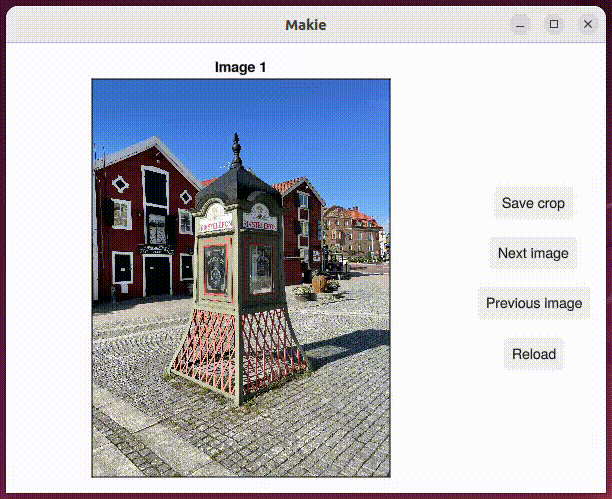

# Pic'n'crop
Pic'n'crop is an interactive cropper made with Julia.

## Prequisite
Julia: `>= 1.7`

packages:  `GLMakie`, `FileIO`, `ImageIO`

## Install
```julia
# go into picncrop directory
<?> cd /path/to/picncrop

# run julia
<?> julia

# switch to pkg mode to activate env
pkg> activate .
  Activating project at `~/path/to/picncrop`

# run instantiate to install packages/dependencies
(picncrop) pkg> instantiate
  Precompiling project...
```

## Run pic'n'crop
```julia
# switch to pkg mode to activate env
pkg> activate .
  Activating project at `~/path/to/picncrop`

# just put some images in the input subfolder and run in REPL
julia> include("picncrop.jl")
```
## Demo
